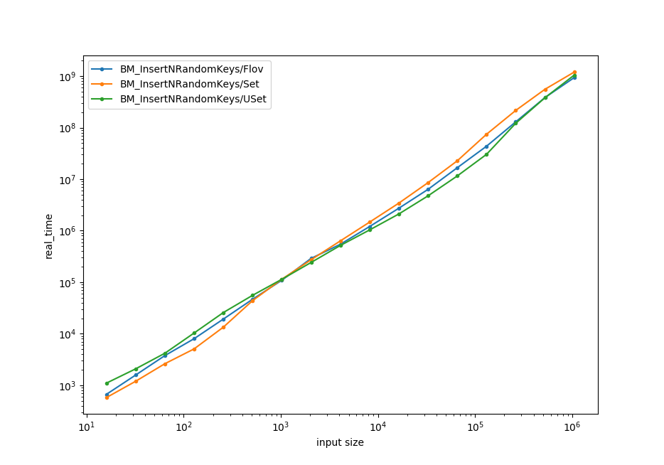

[](https://travis-ci.com/nickitat/flov)

# flov
It is an attempt to implement a cache oblivious data structure with the HashTable interface but using the approach different from both probing and chaining.

## The problem
So, we need a data structure supporting operations `Insert(key)` and `Find(key)`. \
WLOG, `key` is an integer (the result of applying a hash function to the original key).

## The approach
Lets call an element of our data structure "node".
For every node we will maintain a table `links[]` the size of our integer type (in bits).

For the given node `node.link[5]` is defined to be the link to the nearest node (from the right) with a key having exactly the same first 5 bits (from 0-th to 4-th) and which fifth bit is the opposite to the `node.key`'s fifth bit.

So, our data structure is essentially a compressed prefix tree built over the binary representations of the input numbers.

## Implementation

### Find

Find is as simple as that:

```cpp
Find(key) {
    Link current = 0;
    for (int b = 0; b < KEY_BIT_LEN; ++b) {
      if (key differs from nodes[current].key in the b-th bit) {
        current = nodes[current].link[b];
      }
    }
    return current;
}
```

Time complexity: *TFind = O(KeyBitLen)*.

### Insert

Is a bit harder. When we adding a new key we also need to correctly update the links of those preceiding nodes for which the new node is "the nearest node (from the right) with a key having exactly the same first k bits...".\
But actually we can notice that (analogously to how it would be done in prefix tree) it is sufficient to do the following. Find the node with the key having maximal common prefix in binary representation with the given key. And create exactly one new link from this node to the new one.\
So, *TInsert = TFind + O(1)*.

### Delete

TODO.\
I'm pretty confident that we are able to do it with the same complexity as `Insert`.

## Benchmarks

**Mid 2010 MacBook Pro**\
Run on (4 X 2530 MHz CPU s)\
CPU Caches:\
  L1 Data 32K (x2)\
  L1 Instruction 32K (x2)\
  L2 Unified 262K (x2)\
  L3 Unified 3145K (x1)\
Load Average: 1.40, 2.61, 3.74


**Ubuntu VM (Google Cloud)**\
Run on (1 X 2000.16 MHz CPU )\
CPU Caches:\
  L1 Data 32K (x1)\
  L1 Instruction 32K (x1)\
  L2 Unified 256K (x1)\
  L3 Unified 56320K (x1)\
Load Average: 0.04, 0.01, 0.00


**Ubuntu Host**\
Run on (12 X 4100 MHz CPU s)
CPU Caches:
  L1 Data 32K (x6)
  L1 Instruction 32K (x6)
  L2 Unified 256K (x6)
  L3 Unified 9216K (x1)
Load Average: 0.90, 0.72, 0.74

